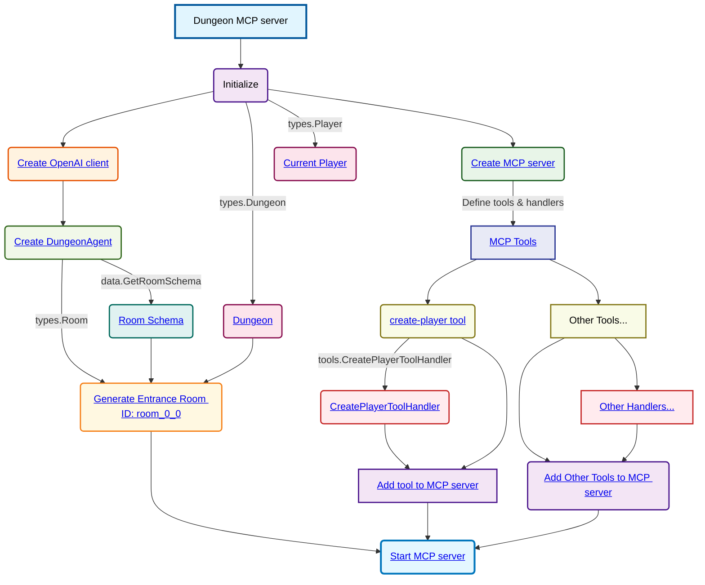

# Dungeon Crawler MCP Server

```mermaid
flowchart TD
    X[Dungeon MCP server]:::main
    X --> Initialize(Initialize):::process

    Initialize --> MCPServer(<a href="/dungeon-crawler-mcp-server/main.go#L26">Create MCP server</a>):::server

    Initialize --> OpenAIClient(<a href="/dungeon-crawler-mcp-server/main.go#L43">Create OpenAI client</a>):::client

    Initialize -->|types.Player| CurrentPlayer(<a href="/dungeon-crawler-mcp-server/main.go#L72">Current Player</a>):::entity

    Initialize -->|types.Dungeon| Dungeon(<a href="/dungeon-crawler-mcp-server/main.go#L92">Dungeon</a>):::entity

    OpenAIClient --> DungeonAgent(<a href="/dungeon-crawler-mcp-server/main.go#L51">Create DungeonAgent</a>):::agent

    DungeonAgent -->|data.GetRoomSchema| RoomSchema(<a href="/dungeon-crawler-mcp-server/data/response.schema.go#L5">Room Schema</a>):::schema

    DungeonAgent -->|types.Room| EntranceRoom(<a href="/dungeon-crawler-mcp-server/main.go#L116">Generate Entrance Room ID: room_0_0</a>):::room
    RoomSchema --> EntranceRoom
    Dungeon --> EntranceRoom

    MCPServer -->|Define tools & handlers| MCPTools[<a href="/dungeon-crawler-mcp-server/main.go#L166">MCP Tools</a>]:::tools

    MCPTools --> CreatePlayerTool(<a href="/dungeon-crawler-mcp-server/tools/create-player.go#L18">create-player tool</a>):::tool
    CreatePlayerTool -->|tools.CreatePlayerToolHandler| PlayerHandler(<a href="/dungeon-crawler-mcp-server/tools/create-player.go#L39">CreatePlayerToolHandler</a>):::handler

    PlayerHandler --> AddClientToolToServer[<a href="/dungeon-crawler-mcp-server/main.go#L173">Add tool to MCP server</a>]:::process
    CreatePlayerTool --> AddClientToolToServer

    MCPTools --> OtherTools[Other Tools...]:::tool
    OtherTools --> OtherHandlers[<a href="003-schema-tools-handlers.md">Other Handlers...<a>]:::handler

    OtherTools --> AddOtherToolsToServer(<a href="/dungeon-crawler-mcp-server/main.go#L177">Add Other Tools to MCP server</a>):::process
    OtherHandlers --> AddOtherToolsToServer

    EntranceRoom --> StartServer(<a href="/dungeon-crawler-mcp-server/main.go#L216">Start MCP server</a>):::final
    AddClientToolToServer --> StartServer
    AddOtherToolsToServer --> StartServer

    classDef main fill:#e1f5fe,stroke:#01579b,stroke-width:3px,color:#000
    classDef process fill:#f3e5f5,stroke:#4a148c,stroke-width:2px,color:#000
    classDef server fill:#e8f5e8,stroke:#1b5e20,stroke-width:2px,color:#000
    classDef client fill:#fff3e0,stroke:#e65100,stroke-width:2px,color:#000
    classDef entity fill:#fce4ec,stroke:#880e4f,stroke-width:2px,color:#000
    classDef agent fill:#f1f8e9,stroke:#33691e,stroke-width:2px,color:#000
    classDef schema fill:#e0f2f1,stroke:#00695c,stroke-width:2px,color:#000
    classDef room fill:#fff8e1,stroke:#f57f17,stroke-width:2px,color:#000
    classDef tools fill:#e8eaf6,stroke:#283593,stroke-width:2px,color:#000
    classDef tool fill:#f9fbe7,stroke:#827717,stroke-width:2px,color:#000
    classDef handler fill:#ffebee,stroke:#c62828,stroke-width:2px,color:#000
    classDef final fill:#e4f7ff,stroke:#0277bd,stroke-width:3px,color:#000
```
