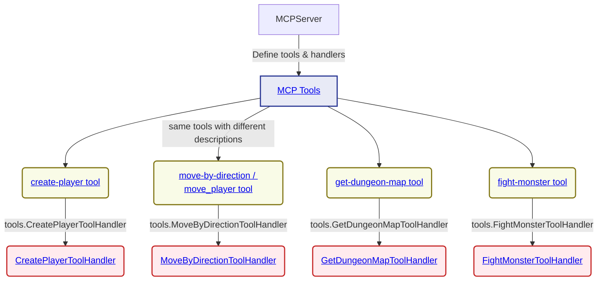

# Dungeon Crawler MCP Server: (most important) Handlers of the game

⬅️ **Back to:** [Dungeon MCP Server Schema](./002-schema-dungeon-mcp-server.md)

```mermaid
flowchart TD
    MCPServer -->|Define tools & handlers| MCPTools[<a href="/dungeon-crawler-mcp-server/main.go#L166">MCP Tools</a>]:::tools

    MCPTools --> CreatePlayerTool(<a href="/dungeon-crawler-mcp-server/tools/create-player.go#L18">create-player tool</a>):::tool
    CreatePlayerTool -->|tools.CreatePlayerToolHandler| PlayerHandler(<a href="/dungeon-crawler-mcp-server/tools/create-player.go#L39">CreatePlayerToolHandler</a>):::handler

    MCPTools -->|same tools with different descriptions| MoveByDirectionTool(<a href="/dungeon-crawler-mcp-server/tools/move-into-the-dungeon.go#L19">move-by-direction / move_player tool</a>):::tool
    MoveByDirectionTool -->|tools.MoveByDirectionToolHandler| MoveByDirectionHandler(<a href="/dungeon-crawler-mcp-server/tools/move-into-the-dungeon.go#L49">MoveByDirectionToolHandler</a>):::handler

    MCPTools --> GetDungeonMapTool(<a href="/dungeon-crawler-mcp-server/tools/get-dungeon-map.go#L13">get-dungeon-map tool</a>):::tool
    GetDungeonMapTool -->|tools.GetDungeonMapToolHandler| GetDungeonMapHandler(<a href="/dungeon-crawler-mcp-server/tools/get-dungeon-map.go#L20">GetDungeonMapToolHandler</a>):::handler

    MCPTools --> FightMonsterTool(<a href="/dungeon-crawler-mcp-server/tools/fight.go#L13">fight-monster tool</a>):::tool
    FightMonsterTool -->|tools.FightMonsterToolHandler| FightMonsterHandler(<a href="/dungeon-crawler-mcp-server/tools/fight.go#L19">FightMonsterToolHandler</a>):::handler


    classDef main fill:#e1f5fe,stroke:#01579b,stroke-width:3px,color:#000
    classDef process fill:#f3e5f5,stroke:#4a148c,stroke-width:2px,color:#000
    classDef server fill:#e8f5e8,stroke:#1b5e20,stroke-width:2px,color:#000
    classDef client fill:#fff3e0,stroke:#e65100,stroke-width:2px,color:#000
    classDef entity fill:#fce4ec,stroke:#880e4f,stroke-width:2px,color:#000
    classDef agent fill:#f1f8e9,stroke:#33691e,stroke-width:2px,color:#000
    classDef schema fill:#e0f2f1,stroke:#00695c,stroke-width:2px,color:#000
    classDef room fill:#fff8e1,stroke:#f57f17,stroke-width:2px,color:#000
    classDef tools fill:#e8eaf6,stroke:#283593,stroke-width:2px,color:#000
    classDef tool fill:#f9fbe7,stroke:#827717,stroke-width:2px,color:#000
    classDef handler fill:#ffebee,stroke:#c62828,stroke-width:2px,color:#000
    classDef final fill:#e4f7ff,stroke:#0277bd,stroke-width:3px,color:#000
```