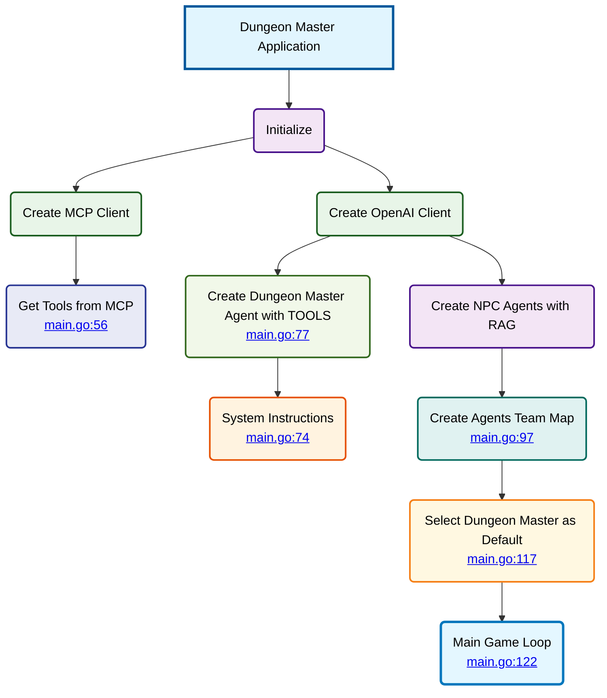

# Dungeon Master Application

```mermaid
flowchart TD
    X[Dungeon Master Application]:::main
    X --> Initialize(Initialize):::process

    Initialize --> OpenAIClient("Create OpenAI Client"):::client
    Initialize --> MCPClient("Create MCP Client"):::client

    MCPClient --> ToolsCatalog("Get Tools from MCP<br/><a href='/dungeon-master/main.go#L56'>main.go:56</a>"):::tools

    OpenAIClient --> DungeonMasterAgent("Create Dungeon Master Agent with TOOLS<br/><a href='/dungeon-master/main.go#L77'>main.go:77</a>"):::agent
    DungeonMasterAgent --> SystemInstructions("System Instructions<br/><a href='/dungeon-master/main.go#L74'>main.go:74</a>"):::config

    OpenAIClient --> NPCAgents("Create NPC Agents with RAG"):::process
    NPCAgents --> AgentsTeam("Create Agents Team Map<br/><a href='/dungeon-master/main.go#L97'>main.go:97</a>"):::team
    AgentsTeam --> DefaultSelection("Select Dungeon Master as Default<br/><a href='/dungeon-master/main.go#L117'>main.go:117</a>"):::selection

    DefaultSelection --> MainLoop("Main Game Loop<br/><a href='/dungeon-master/main.go#L122'>main.go:122</a>"):::loop

    classDef main fill:#e1f5fe,stroke:#01579b,stroke-width:3px,color:#000
    classDef process fill:#f3e5f5,stroke:#4a148c,stroke-width:2px,color:#000
    classDef config fill:#fff3e0,stroke:#e65100,stroke-width:2px,color:#000
    classDef client fill:#e8f5e8,stroke:#1b5e20,stroke-width:2px,color:#000
    classDef tools fill:#e8eaf6,stroke:#283593,stroke-width:2px,color:#000
    classDef tool fill:#f9fbe7,stroke:#827717,stroke-width:2px,color:#000
    classDef agent fill:#f1f8e9,stroke:#33691e,stroke-width:2px,color:#000
    classDef team fill:#e0f2f1,stroke:#00695c,stroke-width:2px,color:#000
    classDef selection fill:#fff8e1,stroke:#f57f17,stroke-width:2px,color:#000
    classDef loop fill:#e4f7ff,stroke:#0277bd,stroke-width:3px,color:#000
```
