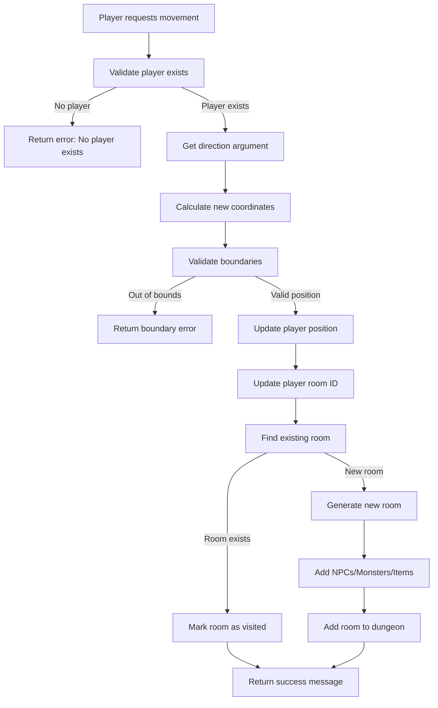

# Move Into The Dungeon Tool

> 🚧 this is a work in progress

## Overview

This module provides tools for player movement within the dungeon game. It handles two main movement mechanisms:
- `move_by_direction`: Basic directional movement
- `move_player`: Primary navigation tool for dungeon exploration

## Tool Definitions

### move_by_direction
- **Purpose**: Move player in specified direction (north, south, east, west)
- **Usage**: Try "move by north"
- **Parameter**: `direction` (required string)

### move_player  
- **Purpose**: Primary navigation tool for exploring rooms
- **Usage**: "move player north" or "go east"
- **Parameter**: `direction` (required string, must be lowercase cardinal direction)

## Movement Flow

